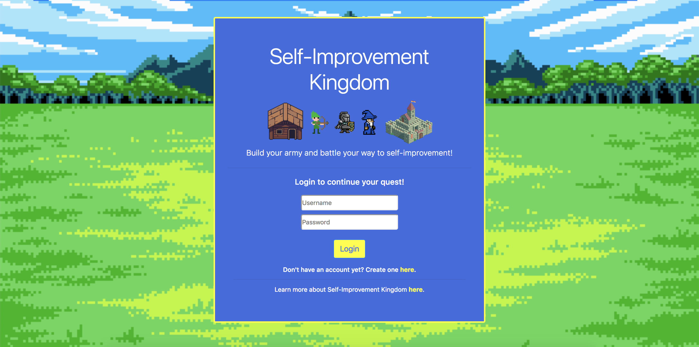
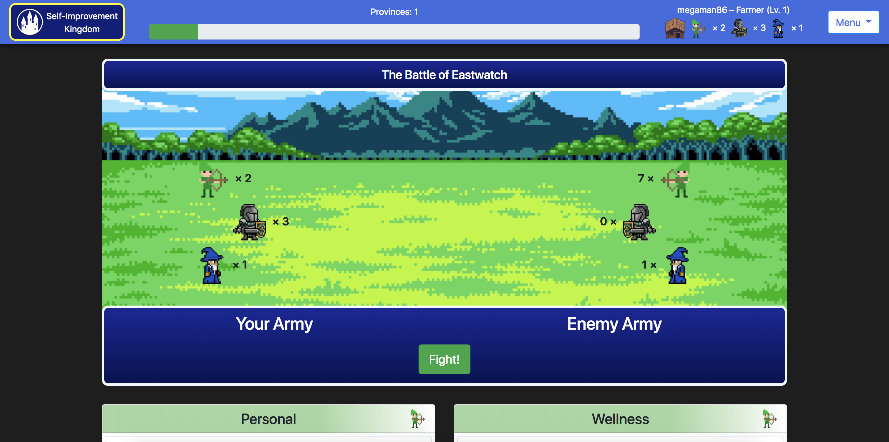

# Self-Improvement Kingdom

Experience here: [Self-Improvement Kingdom](https://nameless-thicket-61553.herokuapp.com/)

## Welcome to Self-Improvement Kingdom!

This app is a gamified task manager that helps you build good habits and rewards you for prioritizing your goals. No gimmicks, no microtransactions, no ads. Too many of today's applications trap users in an endless cycle, sucking away their productivity and money. Our app focuses on just you and your own self-improvement.

We want our users to get out — to be active, to be productive — and all the while remain immersed in the familiar confines of mobile gaming. Your real life accomplishments will directly impact your virtual kingdom, as you build your army and engage in daily battles. The more productive you are throughout the day, the more your kingdom will grow, and soon enough, you will be thriving in both the real world and in ours.

Ultimately, Self-Improvement Kingdom will be what you make of it. It leans heavily on an honor system, and your personal objectives are what you define. We hope you enjoy playing this game as much as we did making it.

## About Self-Improvement Kingdom

Welcome to the Self-Improvement Kingdom! Your goal in this game is to grow your Kingdom through conquest! Not only will your conquer provinces, but your tasks and goals as well.

You start with one province and an army of 3 Knights, 2 Archers, and 1 Mage. You will see one enemy encounter every day, but you have until midnight to bolster your forces before facing them. Complete tasks to bolster your forces!

**Tasks**

Tasks are divided into several different categories:

Personal and Wellness tasks provide an extra archer
Exercise and Chore tasks provide an extra knight
Learning and Creativity tasks provide an extra mage
You set your own objectives! When creating a task, you provide the task name and your evaluation of its difficulty. The task be anything, walking your dog, running a marathon, or even learning JavaScript! The higher the difficulty of the task you set for yourself, the more troops you will receive upon completion.

Once you check off a task, you must choose what unit type you would like to add to your army (the bonus unit will be added automatically as well).

**Combat**

Click the “fight” button to engage your enemy in combat. Once clicked, the battle will run automatically and display the results as it progresses. Some units have an advantage over others, so having the proper army composition for the day is key.

* Knights are strong against Archers
* Archers are strong against Mages
* Mages are strong against Knights

You will either GAIN a province if you are victorious or LOSE a province if you are defeated. The player cannot fall below one province, so losses with one province will only destroy the army. If you do not participate in combat for the day, you will lose a province to the invading enemy forces.

**Conquest**

As you gain provinces, you will expand your empire. Your character will level up to the next rank for every 10 provinces you capture. Keep playing to see your castle grow and your title increase in status.

For every new rank, enemy encounters will become more challenging. In order to maintain a growing empire, you will need to increase the number of good habits you maintain on a daily basis!

Remember, not participating for the day will result in the loss of a province!

**Friends**

You don’t need to conquer the world alone! Add allies by sending a request in the Allies section of the menu and see their activities come up in the footer.

In future updates, we hope to expand upon the “friends” functionality, allowing for group encounters and more!

Good luck and have fun, conquerors!

&nbsp;

Designed, built, and maintained by:

* Eric Keyes
* Harry B Young
* Cadin McQueen
* Brian Fitzgerald

Copyright &#169; 2018